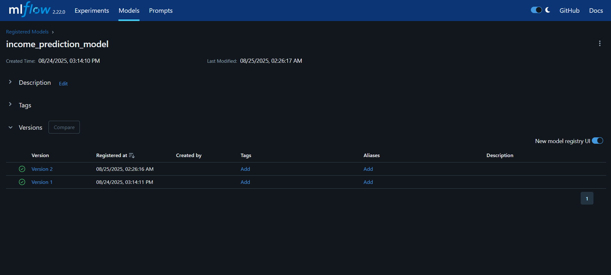
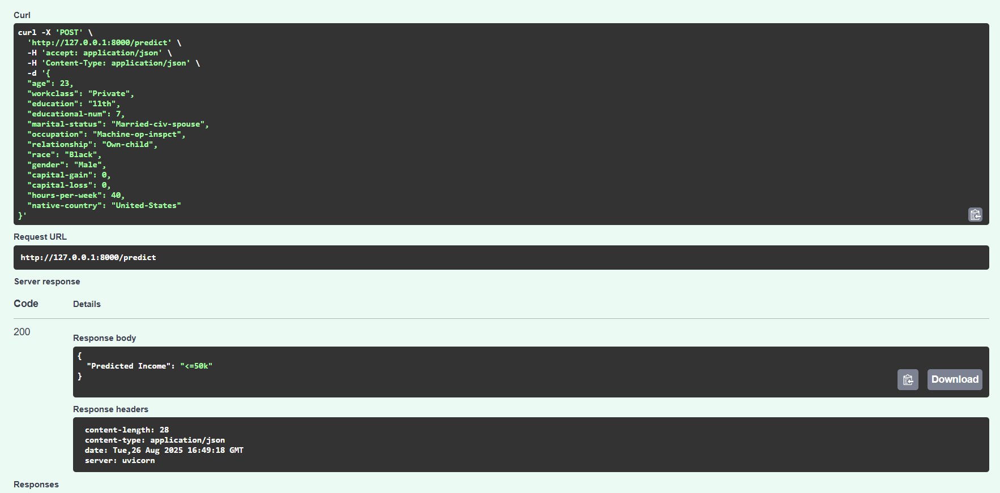
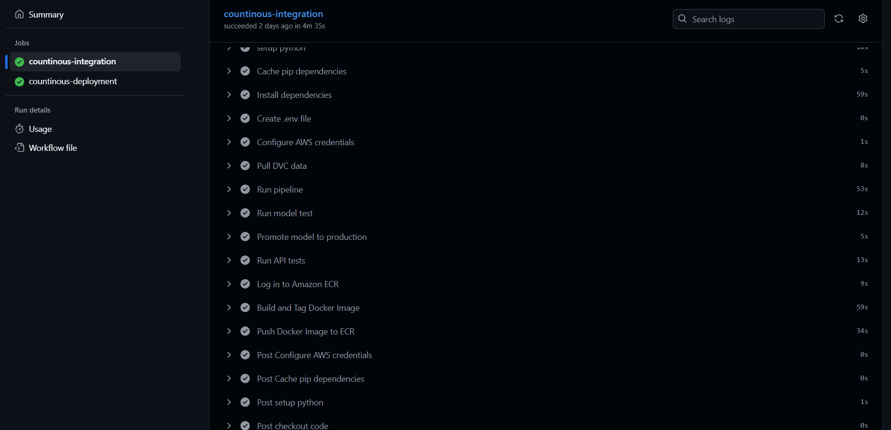
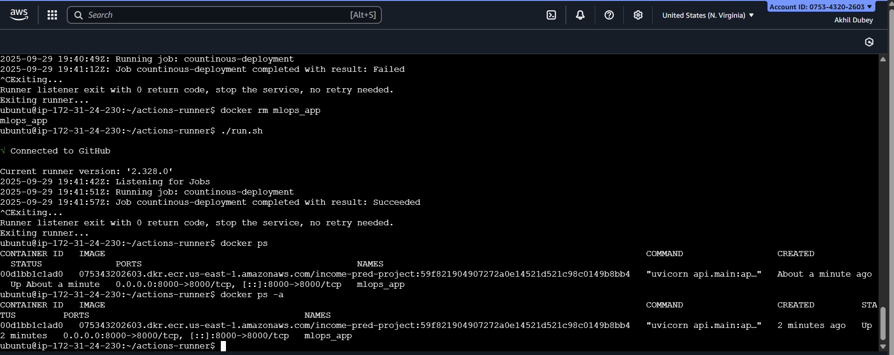
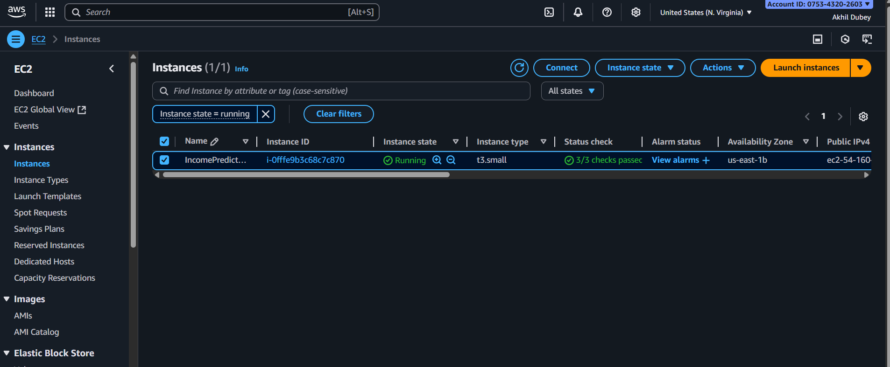

# 🚀 Income Prediction ML App (MLOps Project)

A complete **end-to-end MLOps pipeline** for an Income Prediction application, demonstrating best practices in **Machine Learning Engineering, CI/CD, Experiment Tracking, and Deployment**.  

This project goes beyond building a simple ML model — it covers the **entire lifecycle of ML systems** from experimentation to deployment on AWS.  

---

## ⚙️ Setup & Installation

### 🔹 1. Clone the Repository
```bash 
git clone https://github.com/your-username/income-prediction-mlops.git
cd income-prediction-mlops
```

### 🔹 2. Setup with Virtual Environment
```bash
# Create venv (Linux/Mac)
python3 -m venv venv

# Create venv (Windows)
python -m venv venv
```

#### Activate the environment:
```bash
# Linux/Mac
source venv/bin/activate

# Windows (PowerShell)
venv\Scripts\activate
```

#### Install Dependencies
```
pip install --upgrade pip
pip install -r requirements.txt
```

#### Verify Installation
```
pytest tests/
```

### 🔹 3. Setup with Docker (Optional)
**If you prefer to run everything inside Docker:**
```
# Build Docker image
docker build -t income-prediction .

# Run container
docker run -p 8000:8000 income-prediction
```
**Now visit: 👉 http://127.0.0.1:8000/docs to access FastAPI Swagger UI.**

---

## 📌 Project Workflow  

### 1. Environment Setup
- Created a dedicated **virtual environment (`venv`)**.  
- Installed dependencies with pinned versions via **`requirements.txt`** for reproducibility.  

---

### 2. Experimentation (Core ML Phase)
- Explored multiple models: **Logistic Regression, KNN, SVC**.  
- Performed **data preprocessing, feature engineering, and evaluation** inside Jupyter notebooks.  
- Logged **all experiments and metrics** on **MLflow (remote tracking server on Dagshub)** for version control of experiments.  

---

### 3. Pipeline Development
- Modularized code into reusable pipeline components:
  - 📥 **Data Ingestion**  
  - 🧹 **Data Cleaning**  
  - 🏗 **Feature Engineering**  
  - ⚙️ **Data Preprocessing**  
  - 🤖 **Model Training**  
  - 📊 **Model Evaluation**  
  - 🗂 **Model Registry**  
- **DVC (Data Version Control)** for dataset & pipeline versioning.  
  - Remote storage: **AWS S3**.  
  - Ensures reproducibility across experiments.
  


---

### 4. Model Registry
- Tracked best-performing models in **MLflow Registry**.  
- Registered models with version control (`Staging` stage by default).  
- Ensures only validated models are promoted for serving.  




---

### 5. Model Serving
- Built a **FastAPI backend** for inference.  
- Integrated directly with **latest registered model in MLflow**.  
- **Pydantic** schemas for input validation → robust API interface.  



---

### 6. Testing
- Implemented **unit tests with pytest**:  
  - ✅ **Model Test**: Ensures latest registered model works correctly.  
  - ✅ **API Test**: Validates FastAPI endpoints and schema handling.  

---

### 7. CI/CD Integration
- Set up **GitHub Actions CI pipeline**:  
  - Runs tests (model + API).  
  - Validates pipeline reproducibility.  
  - Builds and pushes Docker images.  
- Implemented **`promote_model.py`** script:  
  - Auto-promotes new model to `Production` if metrics improve over previous version.  



---

### 8. Containerization
- Dockerized **only the API service** for lightweight deployment.  
- Verified container locally before cloud deployment.  
- Integrated Docker build into CI pipeline.  

---

### 9. Deployment
- **AWS ECR**: Stored production Docker images.  
- **AWS EC2 + GitHub Runner**: Pulled & deployed container image.  
- Final **CI/CD workflow**:  
  - Code → GitHub → CI tests → Build Docker → Push to ECR → Deploy on EC2.  




---

## 📂 Project Structure
```bash
.
├── .dvc/                 # DVC metadata
├── .github/workflows/    # CI/CD workflows
├── api/                  # FastAPI backend
├── data/                 # Data (versioned with DVC)
├── experiments/          # Jupyter notebooks for experimentation
├── scripts/              # Utility & pipeline scripts
├── src/                  # Core ML pipeline modules
├── tests/                # Pytest test cases
├── Dockerfile            # API containerization
├── dvc.yaml              # DVC pipeline stages
├── params.yaml           # Hyperparameters/config
├── requirements.txt      # Dependencies
└── README.md             # Project documentation
```

# 📧 Contact

If you're interested in MLOps roles or collaborations:
- Author: **Akhil Dubey**
- 📩 Email: akhdean@gmail.com
- 🔗 Twitter/X: https://x.com/dubey1228